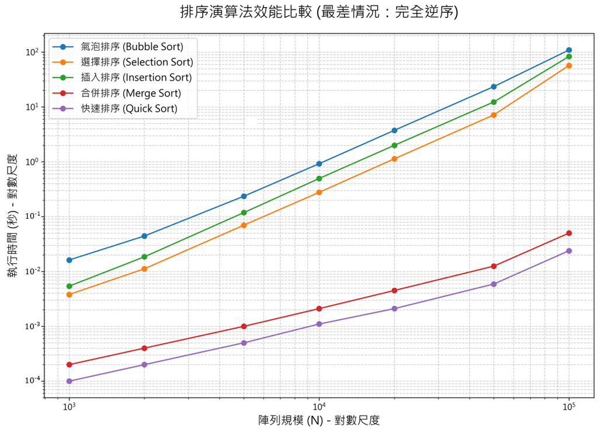

# 排序報告
學號: 11428248 

姓名: 胡泳期 

模擬頁面: https://chiiily.github.io/sort_report/

本報告包含以下五種排序法的原理、複雜度分析與比較：
- Bubble Sort（氣泡排序）
- Selection Sort（選擇排序）
- Insertion Sort（插入排序）
- Merge Sort（合併排序）
- Quick Sort（快速排序）

## 1. Bubble Sort（氣泡排序）

原理：依序比較相鄰元素，將較大元素逐步交換到序列尾端，重複遍歷直到整列排序完成。每一次遍歷時，會從第一個元素開始一對一對比較，如果前方元素比後方元素大，就交換位置。這樣的過程會讓最大的元素在一輪比較結束後「冒泡」到最末端，接著再對剩下未排序的部分繼續同樣操作。

複雜度：
- 最佳：O(n)（若加入是否排序完成的提前終止檢查）
- 平均：O(n^2)
- 最差：O(n^2)
- 空間：O(1)

特性：
- 穩定排序
- 原地排序
- 實作簡單，但大型資料效率低

## 2. Selection Sort（選擇排序）

原理：每輪從未排序區間選出最小元素，與該區間起始元素交換，逐步建立已排序區段。這個演算法每一輪只進行一次交換操作：先遍歷未排序部分尋找最小值的位置，然後將該最小值交換到目前未排序區間的第一個位置。如此一來，已排序區間會逐步從左到右擴大。

複雜度：
- 最佳：O(n^2)
- 平均：O(n^2)
- 最差：O(n^2)
- 空間：O(1)

特性：
- 不穩定排序（交換會改變相同值元素相對順序）
- 原地排序
- 比較次數固定，交換次數較少於泡沫排序

## 3. Insertion Sort（插入排序）

原理：將序列視為已排序區間與未排序區間，依序將未排序元素插入已排序區間中的正確位置。每次從未排序區間取下一個元素，向已排序區間從右到左比較，找到適當位置後插入。若遇到較大的元素，便向右移動，為新的元素騰出空間，直到整個序列都被插入為止。

複雜度：
- 最佳：O(n)
- 平均：O(n^2)
- 最差：O(n^2)
- 空間：O(1)

特性：
- 穩定排序
- 原地排序
- 對於小型資料或近乎有序資料非常高效

## 4. Merge Sort（合併排序）

原理：採用分治法，將序列遞迴分割成較小部分，排序後再合併成最終有序序列。演算法先將待排序資料分成兩半，對每一半遞迴地執行相同動作，直到子序列長度為1。接著從兩個已排序的子序列中逐一比較元素，將最小者放入結果序列，完成合併。

複雜度：
- 最佳：O(n log n)
- 平均：O(n log n)
- 最差：O(n log n)
- 空間：O(n)

特性：
- 穩定排序
- 需要額外空間進行合併
- 適合大型資料與穩定排序需求

## 5. Quick Sort（快速排序）

原理：選取樞紐元素（pivot），將序列分成小於與大於 pivot 的兩部分，對兩部分遞迴排序後合併。通常先選擇一個 pivot，然後在原地進行分區操作，使小於 pivot 的元素移到左側、大於 pivot 的元素移到右側。分區完成後，對左右兩部分繼續遞迴排序，最終整體便成為有序序列。

複雜度：
- 最佳：O(n log n)
- 平均：O(n log n)
- 最差：O(n^2)
- 空間：O(log n)

特性：
- 不穩定排序
- 原地排序
- 實務中平均效能優於合併排序，但需注意最壞情況
- 樞紐 (pivot) 的選擇策略是影響效能的關鍵

---

## 效能實驗與分析

本次專案的第二部分，透過對五種排序演算法在「最差情況（完全逆序）」下的執行效能進行測試。

### 1. 實驗數據表格

在不同資料規模 (N) 下，各演算法的執行時間（秒）。

| 演算法 | N=1000 | N=2000 | N=5000 | N=10000 | N=20000 | N=50000 | N=100000 | 
| :--- | :---: | :---: | :---: | :---: | :---: | :---: | :---: | 
| 氣泡排序 | 0.0162s | 0.0443s | 0.2357s | 0.9219s | 3.7472s | 23.4817s | 109.4277s | 
| 選擇排序 | 0.0038s | 0.0112s | 0.0699s | 0.2775s | 1.1335s | 7.1583s | 57.1007s | 
| 插入排序 | 0.0054s | 0.0185s | 0.1185s | 0.4956s | 1.9958s | 12.3386s | 83.4008s | 
| 合併排序 | 0.0002s | 0.0004s | 0.0010s | 0.0021s | 0.0045s | 0.0125s | 0.0501s | 
| 快速排序 | 0.0001s | 0.0002s | 0.0005s | 0.0011s | 0.0021s | 0.0059s | 0.0239s | 

### 2. 效能比較圖

### 3. 實驗心得與結論

從數據表格與折線圖中，可以得出幾個結論：

 1. **$O(n^2)$ 與 $O(n \log n)$ 的差別體現**:
    氣泡、選擇、插入排序的時間複雜度均為 $O(n^2)$。在圖中，它們呈現出較為陡峭的成長。當資料規模 N 從 1,000 增長到 100,000 時，氣泡排序的執行時間從 0.0162 秒激增至 109.4 秒，成長了超過 6700 倍。
    相比之下，合併排序與快速排序 (O(n log n)) 的曲線則較為平緩，即使在 N=100,000 時，執行時間也僅在 0.05 秒以內，幾乎不受資料規模的影響。
    *在雙對數座標系中，冪函數 $y=ax^k$ 會呈現斜率為 $k$ 的直線

2.  **C++ 程式碼優化的作用**：
    *   **快速排序 (Quick Sort)**：標準的快速排序在處理「完全逆序」陣列時，若每次都選取頭或尾元素作為 Pivot，會退化為 $O(n^2)$ 的最差情況。在測試程式 `expt.cpp` 中，透過 `swap(a[mid], a[high])` 策略，強制選取中間元素作為 Pivot，避免了這種退化。實驗數據顯示，即使在最差輸入下，快速排序依然是所有演算法中最快的，這完全歸功於這個更動。
    `(若不進行該優化，程式會因為迴圈的堆疊溢位而崩潰)`
    *   **合併排序 (Merge Sort)**：我們採用了預先配置一個全域輔助陣列 `reg` 的方式，避免在遞迴過程中頻繁地進行記憶體動態配置與釋放。這個優化減少了系統呼叫的開銷，使其在各種情況下都能維持穩定且高效的 $O(n \log n)$ 表現。

1.  **$O(n^2)$ 演算法之間的比較**：
    在同樣是 $O(n^2)$ 的三種演算法中，選擇排序的表現相對最好。這是因為在最差情況下，雖然比較次數不變，但它的元素交換次數遠少於需要大量交換的氣泡排序和需要大量元素位移的插入排序。

**總結**：這次的實驗在視覺上和數據上驗證了不同排序演算法的理論時間複雜度，更直接地展示演算法設計與優化在實際應用中的決定性影響。一個看似微小的優化（如快速排序的 Pivot 選擇），就能將演算法從「不可用」變為「最高效」。

## 學習心得

這次的排序法報告對我來說比之前的遊戲專案來得簡單一些（少了很多終端機顯示問題），也比較熟悉。

在生成模擬頁面的過程中我遇到了滿多問題，一方面是copilot 配額問題，不能盡情的想問什麼就問什麼。

另一方面，讓人比較頭痛的是，想讓copilot修正html的呈現，但他修正出來一直還是有顯示問題，要透過好幾次的對話，不斷更換敘述的方式（但通常是步驟拆的更細），才有機會更改成功，最後我也在三月底用完了三月的配額，轉而使用gemini pro。

跟copilot相比，他給出的介面優化十分豐富，也比較沒有需要重複溝通的問題，但要將一個修好、覺得可以的排序法頁面作為範本修改另一個排序法的html時，讓他總結一下他聽得懂的文字要求開新對話修改排序法，得到的成果還是會有一些顯示畫面上的差異，最後我還是選擇在同一個對話紀錄完成所有排序法的修正，而不再開新對話紀錄做分類。

在製作排序法報告的過程中我也學到了許多之前不知道的新知識（不同的排序法），雖然對於程式碼的理解還有一點困惑，但也是對這些排序法有了初步的認識。
